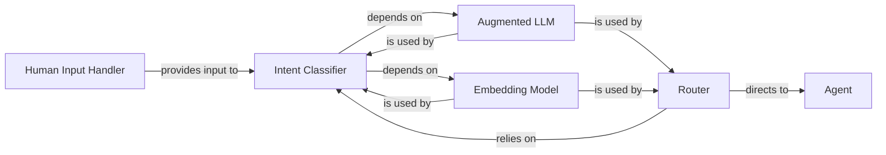

<Info>
This documentation was generated by [CodeBoarding](https://github.com/CodeBoarding/GeneratedOnBoardings) to provide comprehensive insights into the intent and interaction management layer.
</Info>

## Overview

This component is central to how the AI agent framework understands user needs and directs the flow of execution. It encompasses the mechanisms for receiving user input, interpreting their underlying intent, and subsequently routing the request to the most appropriate agent or workflow. This design allows for flexible and intelligent handling of diverse user interactions, leveraging both advanced language models and efficient embedding techniques.

## Core Components

### Human Input Handler

This component serves as the primary interface for direct human interaction with the agent system. It is responsible for capturing and processing console input, including user commands (e.g., slash commands) and queries. It also facilitates elicitation, allowing the agent to prompt the user for necessary information.

**Implementation Details:**
- [View Source](https://github.com/lastmile-ai/mcp-agent/blob/main/src/mcp_agent/human_input/handler.py)

**Key Features:**
- Console input capture
- User command processing
- Slash command support
- Interactive elicitation
- Human-in-the-loop interaction

### Intent Classifier

This abstract base component defines the contract for classifying incoming user input or system states into predefined intents. It is crucial for understanding the user's underlying goal or purpose, which is a prerequisite for effective decision-making within the agent system. The framework supports both LLM-based and embedding-based concrete implementations.

**Implementation Details:**
- [View Source](https://github.com/lastmile-ai/mcp-agent/blob/main/src/mcp_agent/workflows/intent_classifier/intent_classifier_base.py)

**Key Features:**
- Intent classification abstraction
- User goal understanding
- Predefined intent mapping
- LLM-based classification support
- Embedding-based classification support
- System state interpretation

### Router

This abstract base component serves as a central dispatch mechanism within the agent's workflow. Its primary responsibility is to intelligently direct incoming requests or tasks to the most appropriate agent, server, or specific function based on the classified intent and other contextual information. It enables dynamic and flexible routing within the multi-agent orchestration platform.

**Implementation Details:**
- [View Source](https://github.com/lastmile-ai/mcp-agent/blob/main/src/mcp_agent/workflows/router/router_base.py)

**Key Features:**
- Central dispatch mechanism
- Intelligent request routing
- Context-aware decision making
- Dynamic routing capabilities
- Multi-agent orchestration
- Flexible routing strategies

### Augmented LLM

This component provides a unified and augmented interface for interacting with various Large Language Models (LLMs) from different providers (e.g., OpenAI, Anthropic, Google GenAI). It abstracts away the complexities of raw LLM APIs, offering functionalities like prompt engineering, token management, and structured output parsing, which are crucial for robust LLM-based intent classification and routing.

**Implementation Details:**
- [View Source](https://github.com/lastmile-ai/mcp-agent/blob/main/src/mcp_agent/workflows/llm/augmented_llm.py)

**Key Features:**
- Multi-provider LLM support
- Prompt engineering capabilities
- Token management
- Structured output parsing
- API abstraction
- Intent classification support

### Embedding Model

This component provides a standardized interface for generating numerical vector representations (embeddings) of text. These embeddings are fundamental for performing semantic similarity searches and classification tasks, which are utilized in embedding-based intent classification and routing.

**Implementation Details:**
- [View Source](https://github.com/lastmile-ai/mcp-agent/blob/main/src/mcp_agent/workflows/embedding/embedding_base.py)

**Key Features:**
- Text embedding generation
- Semantic similarity analysis
- Vector representation
- Classification support
- Standardized interface
- Similarity search capabilities

### Agent

A generic agent or workflow that the Router directs requests to. This represents the destination for classified and routed requests within the system.

**Key Features:**
- Request execution
- Task processing
- Workflow integration
- Agent capabilities

## Workflow Integration

The Intent & Interaction Management component integrates seamlessly with the overall agent workflow:

1. **Input Capture**: The Human Input Handler captures user input from various sources
2. **Intent Analysis**: The Intent Classifier analyzes the input to determine user intent
3. **Routing Decision**: The Router uses the classified intent to make routing decisions
4. **Agent Execution**: The appropriate agent or workflow is selected and executed
5. **Response Delivery**: Results are returned to the user through the appropriate channels

## Classification Methods

The framework supports multiple classification approaches:

- **LLM-based Classification**: Uses large language models for sophisticated intent understanding
- **Embedding-based Classification**: Uses semantic similarity through embeddings for efficient classification
- **Hybrid Approaches**: Combines both methods for optimal performance

This flexibility allows the system to adapt to different use cases and performance requirements.
