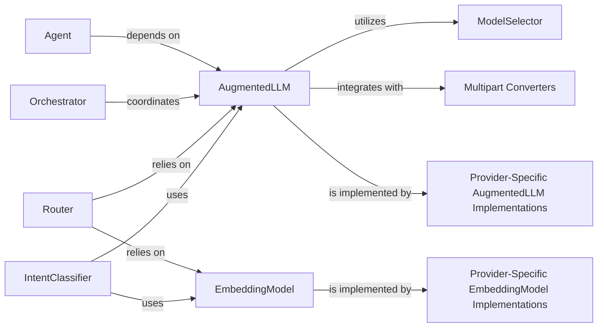

<Info>
This documentation was generated by [CodeBoarding](https://github.com/CodeBoarding/GeneratedOnBoardings) to provide comprehensive insights into the LLM and external tooling layer.
</Info>

## Overview

The LLM & External Tooling component is central to the mcp_agent project, providing the foundational capabilities for interacting with various Large Language Models (LLMs) and embedding services. It embodies the project's architectural bias towards abstraction, extensibility, and modularity, allowing the framework to seamlessly integrate with diverse AI providers and leverage their unique strengths.

## Core Components

### AugmentedLLM

This is the core abstract interface for all Large Language Model (LLM) interactions. It defines a unified API for sending requests and receiving responses from various LLM providers, abstracting away provider-specific details.

**Implementation Details:**
- [View Source](https://github.com/lastmile-ai/mcp-agent/blob/main/src/mcp_agent/workflows/llm/augmented_llm.py#L218-L668)

**Key Features:**
- Unified LLM API
- Provider abstraction
- Request/response handling
- Cross-provider compatibility

### EmbeddingModel

An abstract interface for generating numerical embeddings from text. It provides a consistent way to interact with different embedding service providers.

**Implementation Details:**
- [View Source](https://github.com/lastmile-ai/mcp-agent/blob/main/src/mcp_agent/workflows/embedding/embedding_base.py#L13-L31)

**Key Features:**
- Text embedding generation
- Provider-agnostic interface
- Consistent API across providers
- Numerical representation of text

### ModelSelector

Responsible for dynamically selecting the most appropriate LLM model based on predefined criteria such as cost, latency, or specific model capabilities.

**Implementation Details:**
- [View Source](https://github.com/lastmile-ai/mcp-agent/blob/main/src/mcp_agent/workflows/llm/llm_selector.py#L96-L413)

**Key Features:**
- Dynamic model selection
- Cost optimization
- Latency optimization
- Capability-based selection
- Multi-criteria decision making

### Multipart Converters

These modules handle the conversion of diverse content types (e.g., text, images, tool calls) between the internal Model Context Protocol (MCP) format and the specific input/output formats required by different LLM providers.

**Implementation Details:**
- [Anthropic Converter](https://github.com/lastmile-ai/mcp-agent/blob/main/src/mcp_agent/workflows/llm/multipart_converter_anthropic.py)
- [OpenAI Converter](https://github.com/lastmile-ai/mcp-agent/blob/main/src/mcp_agent/workflows/llm/multipart_converter_openai.py)

**Key Features:**
- Content type conversion
- MCP format standardization
- Provider-specific formatting
- Multi-modal content handling

### Provider-Specific AugmentedLLM Implementations

Concrete implementations of the AugmentedLLM abstract class for specific LLM providers (e.g., Anthropic, OpenAI, Google, Azure, Bedrock, Ollama). These classes contain the actual logic for making API calls to their respective LLM services.

**Implementation Details:**
- [Anthropic Implementation](https://github.com/lastmile-ai/mcp-agent/blob/main/src/mcp_agent/workflows/llm/augmented_llm_anthropic.py#L110-L722)
- [OpenAI Implementation](https://github.com/lastmile-ai/mcp-agent/blob/main/src/mcp_agent/workflows/llm/augmented_llm_openai.py#L80-L845)

**Key Features:**
- Provider-specific API integration
- Authentication handling
- Request formatting
- Response parsing
- Error handling

### Provider-Specific EmbeddingModel Implementations

Concrete implementations of the EmbeddingModel abstract class for specific embedding providers (e.g., Cohere, OpenAI). They handle the actual API calls to generate embeddings.

**Implementation Details:**
- [Cohere Implementation](https://github.com/lastmile-ai/mcp-agent/blob/main/src/mcp_agent/workflows/embedding/embedding_cohere.py#L18-L72)
- [OpenAI Implementation](https://github.com/lastmile-ai/mcp-agent/blob/main/src/mcp_agent/workflows/embedding/embedding_openai.py#L18-L70)

**Key Features:**
- Provider-specific embedding APIs
- Vector generation
- Batch processing
- Dimension handling

## Integration Components

### Agent

Represents the core intelligent entity within the framework, responsible for understanding tasks, making decisions, and executing actions, often by interacting with LLMs and external tools.

**Implementation Details:**
- [View Source](https://github.com/lastmile-ai/mcp-agent/blob/main/src/mcp_agent/agents/agent.py#L56-L931)

### Orchestrator

Manages and coordinates complex, multi-step workflows, often involving multiple LLM calls, tool uses, and interactions between different agents.

**Implementation Details:**
- [View Source](https://github.com/lastmile-ai/mcp-agent/blob/main/src/mcp_agent/workflows/orchestrator/orchestrator.py#L45-L585)

### Router

Intelligently directs incoming requests or internal queries to the most appropriate LLM or embedding model/service based on context, intent, or other routing criteria.

**Implementation Details:**
- [LLM Router](https://github.com/lastmile-ai/mcp-agent/blob/main/src/mcp_agent/workflows/router/router_llm.py#L81-L373)
- [Embedding Router](https://github.com/lastmile-ai/mcp-agent/blob/main/src/mcp_agent/workflows/router/router_embedding.py#L28-L239)

### IntentClassifier

Determines the underlying intent of a user query or system state, leveraging either LLMs or embedding models for classification.

**Implementation Details:**
- [LLM Intent Classifier](https://github.com/lastmile-ai/mcp-agent/blob/main/src/mcp_agent/workflows/intent_classifier/intent_classifier_llm.py#L63-L243)
- [Embedding Intent Classifier](https://github.com/lastmile-ai/mcp-agent/blob/main/src/mcp_agent/workflows/intent_classifier/intent_classifier_embedding.py#L32-L177)
