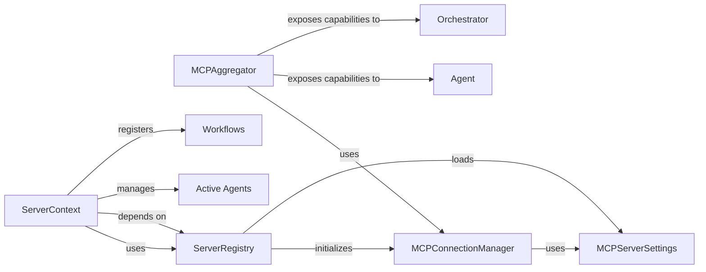

<Info>
This documentation was generated by [CodeBoarding](https://github.com/CodeBoarding/GeneratedOnBoardings) to provide comprehensive insights into the MCP API Gateway infrastructure.
</Info>

## Overview

The MCP & API Gateway component serves as the primary interface for external communication, exposing agent capabilities and workflows via the Model Context Protocol (MCP) and managing connections to other MCP servers. It provides the necessary server-side infrastructure for remote access and interaction.

This component is fundamental to the MCP & API Gateway subsystem because it collectively manages the entire lifecycle of external communication and capability exposure, aligning with the project's 'AI Agent Framework/Orchestration Platform' nature.

## Core Components

### MCPAggregator

The MCPAggregator is a core component responsible for discovering and consolidating capabilities (tools, prompts, and resources) from multiple MCP servers. It acts as a central point for an agent to access and invoke functionalities provided by various remote or local MCP services. It manages persistent connections to servers and provides methods for listing, reading, and calling these aggregated capabilities.

**Implementation Details:**
- [View Source](https://github.com/lastmile-ai/mcp-agent/blob/main/src/mcp_agent/mcp/mcp_aggregator.py)

**Key Features:**
- Capability aggregation from multiple MCP servers
- Persistent connection management
- Unified interface for tools, prompts, and resources
- Central access point for agent capabilities

### ServerRegistry

The ServerRegistry is responsible for managing the configuration and initialization of MCP servers. It loads server configurations from a YAML file, registers initialization hooks, and provides methods to start and initialize server processes based on their defined transport (stdio, streamable HTTP, SSE, websocket). It acts as a directory of available MCP servers.

**Implementation Details:**
- [View Source](https://github.com/lastmile-ai/mcp-agent/blob/main/src/mcp_agent/mcp/mcp_server_registry.py)

**Key Features:**
- Server configuration management
- YAML-based configuration loading
- Transport protocol support (stdio, HTTP, SSE, WebSocket)
- Server initialization and lifecycle management
- Directory of available MCP servers

### ServerContext

The ServerContext provides the operational context for the MCP application server. It holds references to the FastMCP instance (the FastAPI application for MCP), manages active agents, and initializes the appropriate workflow registry (either InMemoryWorkflowRegistry for asyncio or TemporalWorkflowRegistry for Temporal.io). It also facilitates the registration of workflows and the creation of workflow-specific tools.

**Implementation Details:**
- [View Source](https://github.com/lastmile-ai/mcp-agent/blob/main/src/mcp_agent/server/app_server.py)

**Key Features:**
- FastMCP/FastAPI application management
- Active agent management
- Workflow registry initialization
- Workflow registration and tool creation
- Operational context for MCP server

### MCPConnectionManager

The MCPConnectionManager is responsible for establishing, maintaining, and closing connections to various MCP servers. It handles the underlying communication protocols and ensures reliable data exchange between the MCPAggregator and the remote MCP services.

**Implementation Details:**
- [View Source](https://github.com/lastmile-ai/mcp-agent/blob/main/src/mcp_agent/mcp/mcp_connection_manager.py)

**Key Features:**
- Connection establishment and management
- Protocol handling for multiple transports
- Reliable data exchange
- Connection lifecycle management
- Error handling and recovery

### MCPServerSettings

MCPServerSettings defines the configuration parameters for individual MCP servers, including their transport type (e.g., stdio, http, websocket), host, port, and other connection-related details. It is a foundational data structure for setting up and connecting to MCP services.

**Implementation Details:**
- [View Source](https://github.com/lastmile-ai/mcp-agent/blob/main/src/mcp_agent/config.py)

**Key Features:**
- Server configuration parameters
- Transport type specification
- Connection details (host, port, etc.)
- Foundational configuration structure
- Service setup and connection management

## Architecture Benefits

The MCP & API Gateway architecture provides several key benefits:

1. **Unified Interface**: The MCPAggregator consolidates capabilities from disparate MCP servers into a single, unified interface for agents, abstracting away connection complexities.

2. **Multi-Transport Support**: The ServerRegistry supports multiple transport protocols (stdio, HTTP, SSE, WebSocket), enabling flexible deployment and integration scenarios.

3. **Scalable Architecture**: The separation of concerns between configuration (MCPServerSettings), registry (ServerRegistry), connection management (MCPConnectionManager), and aggregation (MCPAggregator) enables scalable and maintainable architecture.

4. **Runtime Flexibility**: The ServerContext provides runtime environment management, supporting both asyncio and Temporal.io execution models.

5. **External Integration**: The component enables seamless integration with external MCP-compliant services, supporting the 'Multi-Agent Coordination Mechanisms' and 'Tool Use Frameworks' aspects of the platform.
