<Info>

```mermaid
graph LR
    Core_Orchestration_Execution["Core Orchestration & Execution"]
    Agent_Workflow_Framework["Agent & Workflow Framework"]
    LLM_External_Tooling["LLM & External Tooling"]
    MCP_API_Gateway["MCP & API Gateway"]
    Intent_Interaction_Management["Intent & Interaction Management"]

    Core_Orchestration_Execution -- "Initializes/Configures" --> Agent_Workflow_Framework
    Core_Orchestration_Execution -- "Manages" --> Agent_Workflow_Framework
    Agent_Workflow_Framework -- "Uses" --> LLM_External_Tooling
    Agent_Workflow_Framework -- "Executes via" --> Core_Orchestration_Execution
    LLM_External_Tooling -- "Provides services to" --> Agent_Workflow_Framework
    LLM_External_Tooling -- "Provides services to" --> Intent_Interaction_Management
    MCP_API_Gateway -- "Exposes" --> Core_Orchestration_Execution
    MCP_API_Gateway -- "Sends requests to" --> Intent_Interaction_Management
    Intent_Interaction_Management -- "Routes requests to" --> Core_Orchestration_Execution
    Intent_Interaction_Management -- "Utilizes" --> LLM_External_Tooling

    click Core_Orchestration_Execution href "/codeboarding/core-orchestration-execution" "Details"
    click Agent_Workflow_Framework href "/codeboarding/agent-workflow-framework" "Details"
    click LLM_External_Tooling href "/codeboarding/llm-external-tooling" "Details"
    click MCP_API_Gateway href "/codeboarding/mcp-api-gateway" "Details"
    click Intent_Interaction_Management href "/codeboarding/intent-interaction-management" "Details"
```

This documentation was generated by [CodeBoarding](https://github.com/CodeBoarding/GeneratedOnBoardings) to provide comprehensive architectural insights into the mcp-agent framework.
</Info>

## Architecture Overview

The `mcp-agent` project is designed as a robust AI Agent Framework and Orchestration Platform, emphasizing modularity, extensibility, and asynchronous execution. The architecture is centered around five key components that manage the lifecycle, execution, and interaction of AI agents and their workflows.

### Core Components

#### [Core Orchestration & Execution](/codeboarding/core-orchestration-execution)
This component is the central nervous system of the application. It handles the overall application lifecycle, loads global configurations, and manages the execution of tasks and complex workflows. It supports both asynchronous and durable execution models, ensuring robust workflow state management.

**Key Classes**:
- `mcp_agent.app.MCPApp` - Main application orchestrator
- `mcp_agent.config.Settings` - Configuration management
- `mcp_agent.executor.executor.Executor` - Task execution engine
- `mcp_agent.executor.workflow.Workflow` - Workflow management

#### [Agent & Workflow Framework](/codeboarding/agent-workflow-framework)
This component defines the foundational interfaces and common behaviors for all AI agents. It implements reusable multi-agent workflow patterns (e.g., orchestration, parallel execution, swarm intelligence, evaluation), providing structured approaches for complex agentic behaviors.

**Key Classes**:
- `mcp_agent.agents.agent.Agent` - Base agent implementation
- `mcp_agent.workflows.orchestrator.orchestrator.Orchestrator` - Orchestration patterns
- `mcp_agent.workflows.parallel.parallel_llm.ParallelLLM` - Parallel execution
- `mcp_agent.workflows.swarm.swarm.Swarm` - Swarm intelligence

#### [LLM & External Tooling](/codeboarding/llm-external-tooling)
This component provides a unified and abstracted interface for interacting with various Large Language Model (LLM) and embedding providers. It handles model selection, request parameterization, and content conversion. Additionally, it offers a flexible framework for defining and integrating external tools that agents can leverage.

**Key Classes**:
- `mcp_agent.workflows.llm.augmented_llm.AugmentedLLM` - Enhanced LLM interface
- `mcp_agent.workflows.llm.llm_selector.ModelSelector` - Model selection logic
- `mcp_agent.workflows.embedding.embedding_base.EmbeddingModel` - Embedding models

#### [MCP & API Gateway](/codeboarding/mcp-api-gateway)
This component serves as the primary interface for external communication. It exposes agent capabilities and workflows via the Model Context Protocol (MCP) and manages connections to other MCP servers. It provides the necessary server-side infrastructure for remote access and interaction.

**Key Classes**:
- `mcp_agent.mcp.mcp_aggregator.MCPAggregator` - MCP server aggregation
- `mcp_agent.mcp.mcp_server_registry.ServerRegistry` - Server registry
- `mcp_agent.server.app_server.ServerContext` - Server context management

#### [Intent & Interaction Management](/codeboarding/intent-interaction-management)
This component is responsible for understanding user intent and directing incoming requests or messages to the appropriate agent or workflow. It supports both LLM-based and embedding-based classification methods and manages direct human interaction, including console input and elicitation.

**Key Classes**:
- `mcp_agent.workflows.router.router_base.Router` - Request routing
- `mcp_agent.workflows.intent_classifier.intent_classifier_base.IntentClassifier` - Intent classification
- `mcp_agent.human_input.handler` - Human input handling
