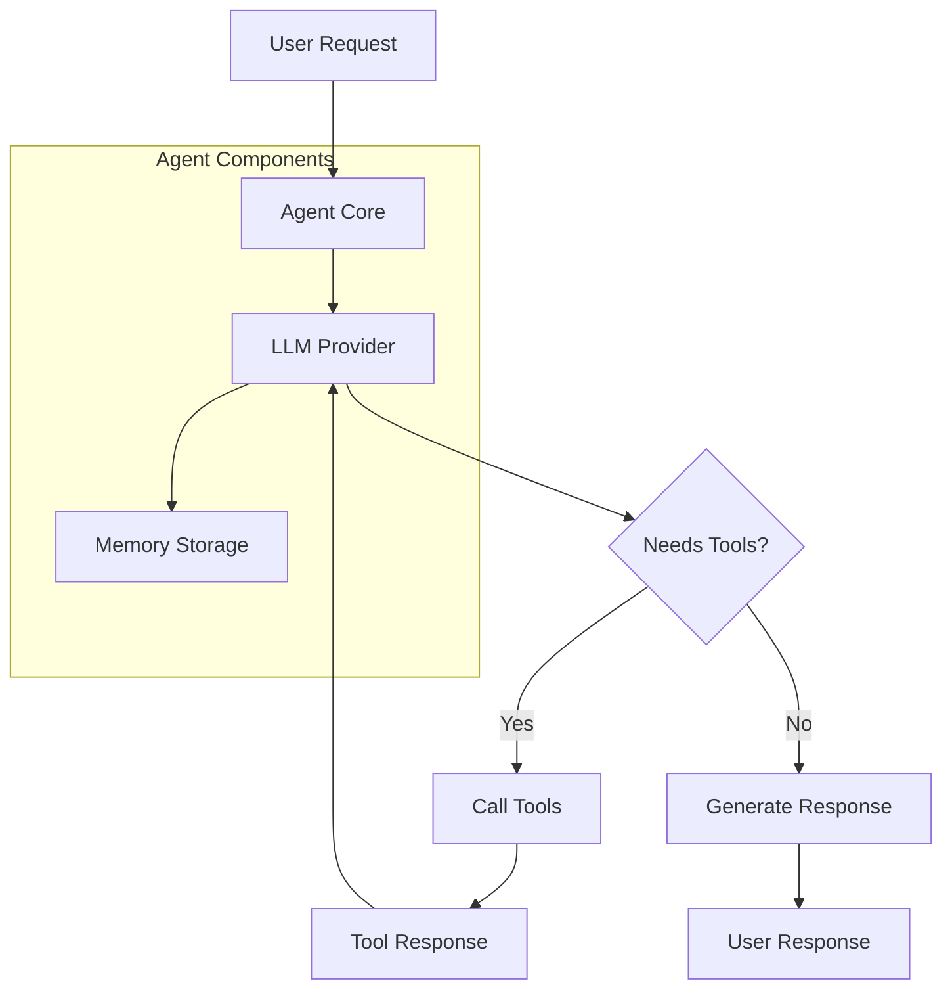

import { Card, CardGroup } from "@mintlify/components";

## What is an Agent?

In the `mcp-agent` framework, an **Agent** is your primary interface for building intelligent applications. An agent combines a Large Language Model (LLM) with specialized capabilities, allowing it to use tools, access data, and interact with external systems to accomplish tasks.

Think of an agent as an intelligent assistant that can:

- Understand natural language requests
- Make decisions about which tools to use
- Execute complex multi-step workflows
- Maintain conversation history and context
- Request human input when needed

<Card>
  **Core Concept:** An Agent is a configured LLM enhanced with tools, memory,
  and the ability to take actions in your environment.
</Card>

## Agent Components

An agent in `mcp-agent` consists of several key components working together:

1. **Agent Core**: Manages the overall workflow and orchestrates interactions
2. **LLM Integration**: Connects to various language model providers (OpenAI, Anthropic, etc.)
3. **Tool Access**: Provides the LLM with capabilities through MCP servers
4. **Memory System**: Maintains conversation history and context
5. **Human Input**: Allows for interactive workflows requiring user input

Here's how these components work together:



## Creating Your First Agent

The simplest way to create an agent is through the `Agent` class. Here's a basic example:

```python
from mcp_agent.agents.agent import Agent
from mcp_agent.workflows.llm.augmented_llm_openai import OpenAIAugmentedLLM

# Create an agent with access to specific tools
finder_agent = Agent(
    name="finder",
    instruction="""You are an agent with access to the filesystem
    and web fetching capabilities. Your job is to find and retrieve
    information based on user requests.""",
    server_names=["fetch", "filesystem"],
)

# Use the agent in an async context
async with finder_agent:
    # Attach an LLM to the agent
    llm = await finder_agent.attach_llm(OpenAIAugmentedLLM)

    # Generate a response
    result = await llm.generate_str(
        message="Find and show me the contents of the README file"
    )
    print(result)
```

<CardGroup>
  <Card title="Tool Integration">
    Agents automatically discover and use tools from connected MCP servers,
    giving your LLM powerful capabilities.
  </Card>
  <Card title="Multi-Provider Support">
    Switch between different LLM providers (OpenAI, Anthropic, etc.) without
    changing your agent logic.
  </Card>
</CardGroup>

## Agent Configuration

Agents can be configured either programmatically or through configuration files. The framework supports both approaches:

### Configuration File Approach

Create a `mcp_agent.config.yaml` file to define your agent's environment:

```yaml
# mcp_agent.config.yaml
$schema: ../../schema/mcp-agent.config.schema.json

execution_engine: asyncio

# Configure logging
logger:
  transports: [console, file]
  level: debug
  progress_display: true

# Define available MCP servers (tools)
mcp:
  servers:
    fetch:
      command: "uvx"
      args: ["mcp-server-fetch"]
    filesystem:
      command: "npx"
      args: ["-y", "@modelcontextprotocol/server-filesystem"]

# LLM provider configuration
openai:
  default_model: "gpt-4o-mini"
```

### Programmatic Configuration

You can also configure agents directly in code:

```python
from mcp_agent.config import Settings, MCPSettings, MCPServerSettings

settings = Settings(
    execution_engine="asyncio",
    mcp=MCPSettings(
        servers={
            "fetch": MCPServerSettings(
                command="uvx",
                args=["mcp-server-fetch"],
            ),
            "filesystem": MCPServerSettings(
                command="npx",
                args=["-y", "@modelcontextprotocol/server-filesystem"],
            ),
        }
    ),
    openai=OpenAISettings(
        default_model="gpt-4o-mini",
    ),
)
```

## Agent Capabilities

Agents in `mcp-agent` come with several powerful built-in capabilities:

### Multi-LLM Provider Support

Switch between different LLM providers seamlessly:

```python
from mcp_agent.workflows.llm.augmented_llm_openai import OpenAIAugmentedLLM
from mcp_agent.workflows.llm.augmented_llm_anthropic import AnthropicAugmentedLLM

async with agent:
    # Start with OpenAI
    llm = await agent.attach_llm(OpenAIAugmentedLLM)
    result1 = await llm.generate_str("Analyze this data...")

    # Switch to Anthropic for the next task
    llm = await agent.attach_llm(AnthropicAugmentedLLM)
    result2 = await llm.generate_str("Summarize the analysis...")
```

### Advanced Model Selection

Control model selection with preferences:

```python
from mcp_agent.workflows.llm.augmented_llm import RequestParams
from mcp_agent.workflows.llm.llm_selector import ModelPreferences

result = await llm.generate_str(
    message="Complex reasoning task",
    request_params=RequestParams(
        modelPreferences=ModelPreferences(
            costPriority=0.1,        # Low cost priority
            speedPriority=0.2,       # Low speed priority
            intelligencePriority=0.7  # High intelligence priority
        ),
        temperature=0.3,
        maxTokens=1000,
    )
)
```

### Human Input Integration

Agents can request human input during execution:

```python
# The agent can automatically request human input when needed
# This is handled through the human_input_callback mechanism
# and appears as a tool the LLM can call
from mcp_agent.human_input.handler import console_input_callback

app = MCPApp(name="my_application", human_input_callback=console_input_callback)

# ...rest of your code

result = await llm.generate_str(
    "Please review this analysis and ask me any questions you need clarification on."
)
```

### Memory and Context Management

Agents maintain conversation history automatically:

```python
# Multi-turn conversations maintain context
result1 = await llm.generate_str("What's the weather like?")
result2 = await llm.generate_str("What about tomorrow?")  # Remembers context
```

## Agent Lifecycle Management

Agents follow a predictable lifecycle:

### 1. Initialization

When you create an agent, it:

- Loads configuration from files or code
- Connects to specified MCP servers
- Discovers available tools and capabilities

### 2. Usage

During operation, the agent:

- Processes user requests through the LLM
- Orchestrates tool calls as needed
- Maintains conversation history
- Handles errors and retries

### 3. Cleanup

When finished, the agent:

- Closes connections to MCP servers
- Releases resources
- Saves any persistent state

```python
# Explicit lifecycle management
agent = Agent(name="my_agent", server_names=["fetch"])

# Initialize
await agent.initialize()

# Use
llm = await agent.attach_llm(OpenAIAugmentedLLM)
result = await llm.generate_str("Hello!")

# Cleanup
await agent.shutdown()

# Or use context manager (recommended)
async with Agent(name="my_agent", server_names=["fetch"]) as agent:
    llm = await agent.attach_llm(OpenAIAugmentedLLM)
    result = await llm.generate_str("Hello!")
    # Automatic cleanup when exiting context
```

## Common Usage Patterns

### Application Integration

Use the `MCPApp` class for full application setup:

```python
from mcp_agent.app import MCPApp

app = MCPApp(name="my_application")

async def main():
    async with app.run() as agent_app:
        logger = agent_app.logger
        context = agent_app.context

        # Create and use agents within the app context
        agent = Agent(
            name="assistant",
            instruction="You are a helpful assistant.",
            server_names=["filesystem", "fetch"]
        )

        async with agent:
            llm = await agent.attach_llm(OpenAIAugmentedLLM)
            result = await llm.generate_str("Help me organize my files")
            logger.info("Task completed", data={"result": result})
```

### Tool Discovery

Explore what tools are available to your agent:

```python
async with agent:
    # List all available tools
    tools = await agent.list_tools()
    print(f"Available tools: {[tool.name for tool in tools.tools]}")

    # Get detailed tool information
    for tool in tools.tools:
        print(f"Tool: {tool.name}")
        print(f"Description: {tool.description}")
        print(f"Input schema: {tool.inputSchema}")
```

This covers the essential concepts users need to understand and effectively use agents in the mcp-agent framework.
