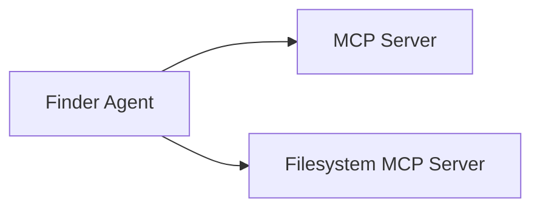

<Info>
  Make sure you have [installed mcp-agent](/installation) before proceeding.
</Info>

## Overview

We'll create a "finder" agent that has access to two MCP servers:

- **Fetch Server**: For retrieving web content
- **Filesystem Server**: For reading local files

<Frame>



</Frame>

## Step 1: Set Up Your Project

<Steps>
    <Step title="Create a new directory">
      ```bash
      mkdir my-first-agent
      cd my-first-agent
      ```
    </Step>

    <Step title="Install dependencies">
      <CodeGroup>
        ```bash uv
        uv init
        uv add "mcp-agent[openai]"
        ```

        ```bash pip
        python -m venv .venv
        source .venv/bin/activate # On Windows: .venv\Scripts\activate 
        pip install "mcp-agent[openai]"
        ```
      </CodeGroup>

    </Step>

</Steps>

## Step 2: Configure Your Agent

Create two configuration files:

<Tab>

```yaml mcp_agent.config.yaml
execution_engine: asyncio
logger:
  transports: [console]
  level: info

mcp:
  servers:
    fetch:
      command: "uvx"
      args: ["mcp-server-fetch"]
      description: "Fetch content from URLs"
    filesystem:
      command: "npx"
      args: ["-y", "@modelcontextprotocol/server-filesystem", "."]
      description: "Read and write local files"

openai:
  default_model: gpt-4o
```

```yaml mcp_agent.secrets.yaml
openai:
  api_key: "your-openai-api-key-here"
```

</Tab>

<Warning>
  Replace `"your-openai-api-key-here"` with your actual OpenAI API key. You can
  get one from the [OpenAI platform](https://platform.openai.com/api-keys).
</Warning>

## Step 3: Create Your Agent

Create a file called `main.py`:

<CodeGroup>

```python main.py
import asyncio
from mcp_agent.app import MCPApp
from mcp_agent.agents.agent import Agent
from mcp_agent.workflows.llm.augmented_llm_openai import OpenAIAugmentedLLM

# Create the MCP app

app = MCPApp(name="finder_agent")

async def main():
    async with app.run() as mcp_agent_app:
        logger = mcp_agent_app.logger

        # Create an agent with access to fetch and filesystem servers
        finder_agent = Agent(
            name="finder",
            instruction="""You can read local files or fetch URLs.
                Return the requested information when asked.""",
            server_names=["fetch", "filesystem"]
        )

        async with finder_agent:
            # List available tools
            list_tools_result = await finder_agent.list_tools()
            logger.info("Available tools:", data=[tool.name for tool in list_tools_result.tools])

            # Attach an OpenAI LLM to the agent
            llm = await finder_agent.attach_llm(OpenAIAugmentedLLM)

            # Example 1: Read a local file
            print("\n🔍 Reading local file...")
            result = await llm.generate_str(
                "Create a simple README.md file, then show me its contents"
            )
            print(f"📄 Result: {result}")

            # Example 2: Fetch web content
            print("\n🌐 Fetching web content...")
            result = await llm.generate_str(
                "Fetch the first two paragraphs from https://www.anthropic.com/research/building-effective-agents"
            )
            print(f"📰 Result: {result}")

            # Example 3: Multi-turn conversation
            print("\n💬 Multi-turn conversation...")
            result = await llm.generate_str(
                "Summarize that content in a 140-character tweet"
            )
            print(f"🐦 Tweet: {result}")

if __name__ == "__main__":
    asyncio.run(main())
```

</CodeGroup>

## Step 4: Run Your Agent

<Tabs>

    <Tab title="uv">
      ```bash
      uv run main.py
      ```
    </Tab>
    <Tab title="python">
      ```bash
      python main.py
      ```
    </Tab>

</Tabs>

## Expected Output

You should see output similar to this:

```
  🔍 Reading local file...
  📄 Result: I've created a README.md file with basic project information. Here's its contents:

  # My First Agent

  This is a simple mcp-agent that can read files and fetch web content.

  ## Features
  - File system access
  - Web content fetching
  - Multi-turn conversations

  🌐 Fetching web content...
  📰 Result: According to Anthropic's research on building effective agents,
  there are several key patterns for creating robust AI systems...

  💬 Multi-turn conversation...
  🐦 Tweet: Anthropic's research reveals key patterns for building effective AI agents:
  parallel processing, routing, and human feedback loops. #AI #Agents
```

## What Just Happened?

<CardGroup cols={2}>
  <Card title="Agent Creation" icon="robot">
    You created an agent with specific instructions and access to two MCP
    servers
  </Card>
  <Card title="Tool Discovery" icon="search">
    The agent automatically discovered available tools from connected MCP
    servers
  </Card>
  <Card title="LLM Integration" icon="brain">
    You attached an OpenAI LLM that can use the discovered tools
  </Card>
  <Card title="Multi-turn Chat" icon="comments">
    The agent maintains conversation context across multiple interactions
  </Card>
</CardGroup>

## Troubleshooting

<AccordionGroup>

    <Accordion title="OpenAI API Key Error">
      Make sure your API key is correctly set in `mcp_agent.secrets.yaml` and that you have credits in your OpenAI account.
    </Accordion>

    <Accordion title="MCP Server Not Found">
      Ensure the MCP servers are properly configured in `mcp_agent.config.yaml` and they are included in finder_agent's `server_names` list.
    </Accordion>

    <Accordion title="Permission Denied">
      The filesystem server can only access files in the directory you specify. Make sure the current directory (`.`) is accessible.
    </Accordion>

</AccordionGroup>

## Next Steps

<CardGroup cols={2}>
  <Card
    title="Learn Core Concepts"
    icon="graduation-cap"
    href="/concepts/agents"
  >
    Understand how agents, MCP servers, and LLMs work together
  </Card>
  <Card
    title="Explore Workflow Patterns"
    icon="diagram-project"
    href="/workflows/overview"
  >
    Discover advanced patterns like parallel processing and routing
  </Card>
  <Card
    title="Try Different Providers"
    icon="shuffle"
    href="/configuration#model-provider-configuration"
  >
    Use Anthropic Claude, Azure, or other LLM providers
  </Card>
  <Card title="Build Integrations" icon="plug" href="/integrations/streamlit">
    Create web apps, Claude Desktop integrations, and more
  </Card>
</CardGroup>

<Tip>
  Check out the [examples
  directory](https://github.com/lastmile-ai/mcp-agent/tree/main/examples) for
  30+ working examples covering different use cases and patterns.
</Tip>
