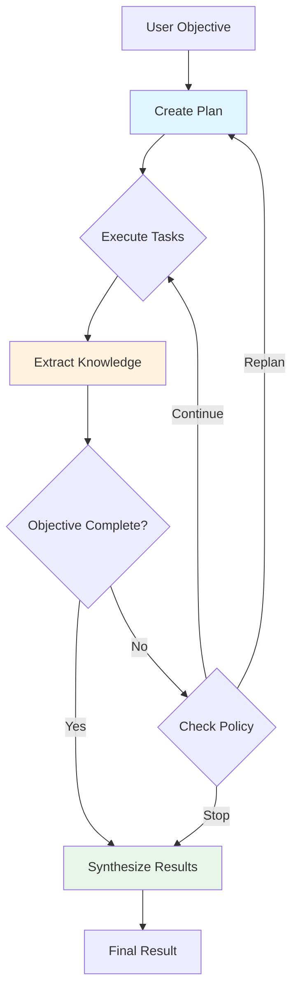
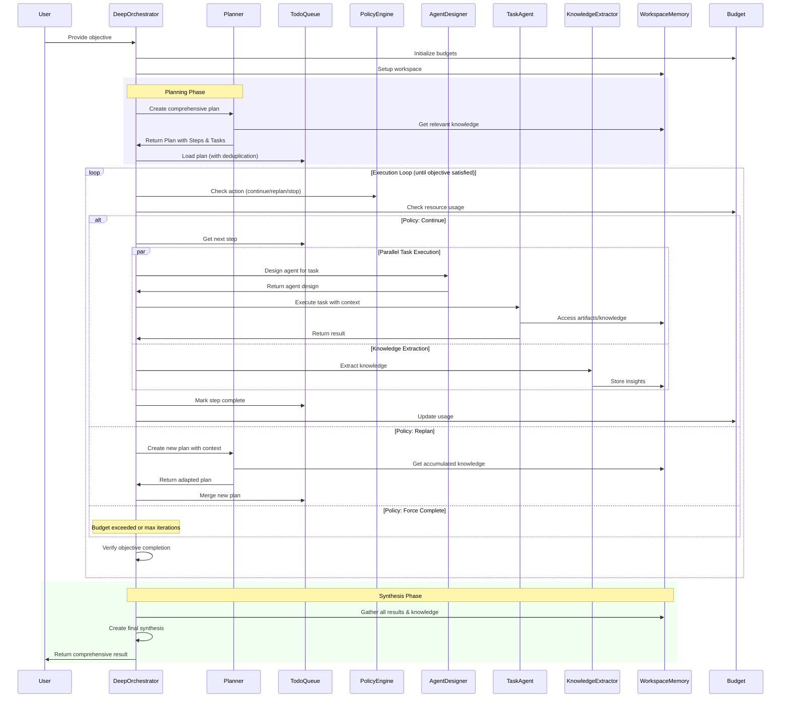

# Deep Orchestrator

A production-ready adaptive workflow orchestration system that implements multi-agent research patterns for complex, long-horizon tasks. Inspired by [Anthropic's multi-agent research system](https://www.anthropic.com/engineering/built-multi-agent-research-system) and deep research architectures.

## Overview

The Deep Orchestrator extends beyond [basic orchestrator-worker](../orchestrator/orchestrator.py) pattern by implementing:

- **Adaptive Planning**: Creates comprehensive execution plans upfront, then adapts based on results
- **Dynamic Agent Creation**: Designs and spawns specialized agents optimized for each task
- **Knowledge Accumulation**: Extracts and persists insights across the entire workflow
- **Intelligent Replanning**: Monitors progress and replans when objectives aren't met
- **Resource Management**: Enforces budgets for tokens, cost, and time
- **Context Optimization**: Manages memory outside context windows for efficient token usage

## Architecture

The system follows a research-inspired architecture where a lead orchestrator coordinates specialized subagents, similar to how "a lead agent analyzes the query, develops a strategy, and spawns subagents to explore different aspects of the problem in parallel" (Anthropic, 2024).

### Core Components

- **[DeepOrchestrator](./orchestrator.py)**: Main orchestration engine that manages the entire workflow lifecycle
- **[TodoQueue](./queue.py)**: Task queue with deduplication and dependency management
- **[WorkspaceMemory](./memory.py)**: Persistent knowledge storage with context management
- **[PolicyEngine](./policy.py)**: Decision-making system for workflow control
- **[KnowledgeExtractor](./knowledge.py)**: Extracts structured insights from task outputs
- **[AgentCache](./cache.py)**: LRU cache for dynamically created agents
- **[SimpleBudget](./budget.py)**: Multi-dimensional resource tracking (tokens, cost, time)

### High-Level Flow



### Detailed Sequence Diagram



## When to Use DeepOrchestrator vs Standard Orchestrator

The [standard Orchestrator](../orchestrator/orchestrator.py) class provides a simpler orchestrator-workers workflow for tasks with predictable decomposition. DeepOrchestrator extends this with adaptive capabilities.

### Use DeepOrchestrator When:

- **Complex Research Tasks**: Multi-faceted problems requiring extensive exploration and synthesis
- **Unknown Task Decomposition**: You can't predict all subtasks upfront
- **Long-Running Workflows**: Tasks that may require many iterations to complete
- **Knowledge Building**: Need to accumulate and reuse insights across the workflow
- **Resource Constraints**: Must manage tokens, costs, or time budgets carefully
- **Adaptive Requirements**: Task strategy needs to evolve based on findings

### Use Standard Orchestrator When:

- **Well-Defined Tasks**: Clear subtask decomposition can be one-shotted.
- **Simple Workflows**: Tasks complete in a few predictable steps
- **Fixed Agent Set**: All required agents are predefined
- **No Memory Needed**

### Key Differences

| Feature             | Standard Orchestrator          | Deep Orchestrator                           |
| ------------------- | ------------------------------ | ------------------------------------------- |
| Planning            | Fixed plan or simple iteration | Comprehensive upfront + adaptive replanning |
| Agents              | Predefined set only            | Dynamic creation + caching                  |
| Memory              | In-context only                | Persistent workspace + knowledge extraction |
| Execution           | Single pass                    | Iterative until objective satisfied         |
| Resource Management | Basic                          | Full budget tracking (tokens/cost/time)     |
| Context Management  | Standard                       | Smart compression + relevance filtering     |

## Features

### 1. Comprehensive Planning

The system creates detailed execution plans with:

- Sequential steps for dependency management
- Parallel tasks within steps for efficiency
- Clear task boundaries and deliverables
- Dynamic agent assignment

### 2. Dynamic Agent Design

For each task, the system can:

- Analyze requirements and needed tools
- Design specialized agent instructions
- Create focused agents with specific expertise
- Cache agents for reuse

### 3. Knowledge Management

Implements a sophisticated memory system:

- Extracts key insights from every task
- Categorizes knowledge by type and confidence
- Provides relevance-based retrieval
- Manages context size through smart trimming

### 4. Adaptive Execution

The workflow adapts through:

- Continuous objective verification
- Policy-driven decision making
- Smart replanning when needed
- Resource-aware execution

### 5. Resource Budgeting

Comprehensive resource management:

- **Token Budget**: Tracks and limits token usage
- **Cost Budget**: Monitors API costs
- **Time Budget**: Enforces execution time limits
- **Context Budget**: Manages tokens per task

## Usage

```python
from mcp_agent.workflows.deep_orchestrator import DeepOrchestrator

# Create orchestrator with available resources
orchestrator = DeepOrchestrator(
    llm_factory=llm_factory,
    available_agents=[agent1, agent2],  # Optional predefined agents
    available_servers=["web_search", "code_analysis"],
    max_iterations=20,
    max_replans=3,
    enable_filesystem=True,  # Enable persistent workspace
    task_context_budget=50000,  # Max tokens per task
)

# Execute complex objective
result = await orchestrator.generate(
    "Analyze the codebase architecture and create a comprehensive
    technical documentation with diagrams and examples"
)
```

## Configuration

### Key Parameters

- `max_iterations`: Maximum workflow iterations (default: 20)
- `max_replans`: Maximum replanning attempts (default: 3)
- `enable_filesystem`: Enable persistent workspace (default: True)
- `enable_parallel`: Enable parallel task execution (default: True)
- `max_task_retries`: Retries per failed task (default: 3)
- `task_context_budget`: Maximum tokens for task context (default: 50000)
- `context_relevance_threshold`: Minimum relevance score for context inclusion (default: 0.7)
- `context_compression_ratio`: When to start compressing context (default: 0.8)

### Budget Configuration

```python
# Token budget (default: 100,000)
orchestrator.budget.max_tokens = 200000

# Cost budget in dollars (default: $10)
orchestrator.budget.max_cost = 25.0

# Time budget in minutes (default: 30)
orchestrator.budget.max_time_minutes = 60
```

## Implementation Details

### Execution Flow

1. **Planning Phase**

   - Analyzes objective and accumulated knowledge
   - Creates comprehensive execution plan
   - Validates plan for correctness

2. **Execution Loop**

   - Executes steps sequentially
   - Runs tasks within steps in parallel
   - Extracts knowledge from results
   - Monitors resource usage

3. **Verification Phase**

   - Checks if objective is satisfied
   - Evaluates confidence in completion
   - Triggers replanning if needed

4. **Synthesis Phase**
   - Aggregates all work completed
   - Combines knowledge and artifacts
   - Produces final deliverable

### Context Management

The system implements sophisticated context management:

- **Relevance Scoring**: Prioritizes context based on task similarity
- **Smart Compression**: Compresses less relevant content to fit budgets
- **Dependency Tracking**: Includes explicitly requested task outputs
- **Knowledge Integration**: Weaves in high-confidence insights

### Error Handling

Robust error handling includes:

- Task-level retries with exponential backoff
- Policy-driven failure management
- Emergency completion on critical failures
- Graceful degradation with partial results

## Best Practices

1. **Set Appropriate Budgets**: Configure resource limits based on task complexity
2. **Enable Filesystem**: Use persistent workspace for long-running tasks
3. **Monitor Progress**: Check logs for iteration progress and resource usage
4. **Leverage Knowledge**: Let the system build and reuse insights
5. **Trust Adaptation**: Allow replanning for better results

## Example Workflows

### Research Task

```python
result = await orchestrator.generate(
    "Research quantum computing applications in cryptography,
    analyze current limitations, and propose future directions"
)
```

### Code Analysis

```python
result = await orchestrator.generate(
    "Analyze this codebase for security vulnerabilities,
    create a prioritized fix plan, and implement critical fixes"
)
```

### Content Creation

```python
result = await orchestrator.generate(
    "Create a comprehensive guide on machine learning deployment,
    including examples, best practices, and common pitfalls"
)
```

## References

- [Multi-agent research system](https://www.anthropic.com/engineering/built-multi-agent-research-system) - Anthropic (2024)
- [A Practical Guide to Implementing DeepSearch & DeepResearch](https://jina.ai/news/a-practical-guide-to-implementing-deepsearch-deepresearch/) - Jina AI (2024)
- Deep Research architectures for long-horizon complex tasks
- Multi-agent orchestration patterns for adaptive workflows
